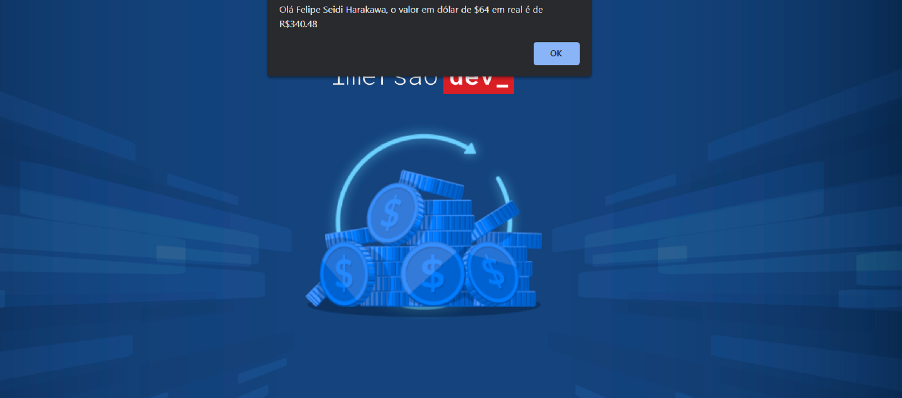

<h1 align="center"> Conversor de Moedas </h1>

Imersão Dev é um evento exclusivo e gratuito, promovido pela Alura para ensino de tecnologias WEB.  

  <a href="#-tecnologias">Tecnologias</a>     |    
  <a href="#-projeto">Projeto</a>     |    
  <a href="#-layout">Layout</a>     |    
  <a href="#-licença">Licença</a>

  

 

  

## 🚀 Tecnologias

Esse projeto foi desenvolvido com as seguintes tecnologias:

- HTML e CSS
- JavaScript
- Git e Github
- CodePen

## 💻 Projeto

O Conversor de Moedas converte de forma manual (não dinamico) o valor da cotação do dólar em real e mostra através de um alert os valores convertidos.

- [ Visite o projeto online ]()

## 🔖 Layout

Você pode visualizar o layout do projeto através de [ DESSE LINK ](https://codepen.io/imersao-dev/pen/BapaBPO). É necessário ter conta no [ CodePen ](https://codepen.io/accounts/signup/user/free) para acessá-lo.

## ✅ Licença

Esse projeto está sob a licença MIT.

---

Feito com 🧡 por Felipe Seidi Harakawa 👋.
